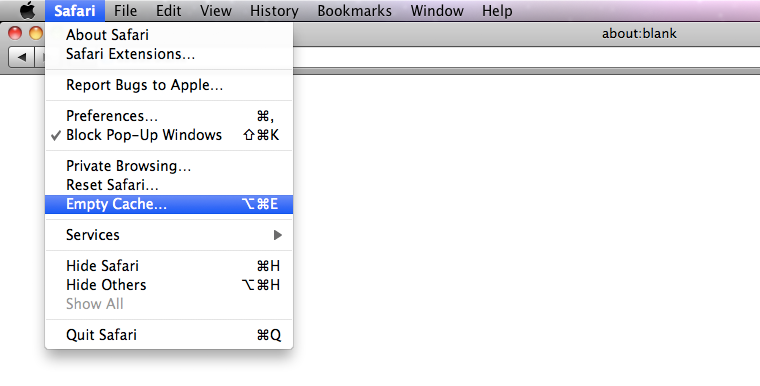

    Explore
    Gist
    Blog
    Help

    Loudcleardotca Loudcleardotca

    1
    0
    0

public Loudcleardotca / Website-Support

Website-Support / website-support.html
Loudcleardotca Loudcleardotca 12 minutes ago
Website Support Initial Commit

1 contributor
file 99 lines (95 sloc) 9.331 kb
1 2 3 4 5 6 7 8 9 10 11 12 13 14 15 16 17 18 19 20 21 22 23 24 25 26 27 28 29 30 31 32 33 34 35 36 37 38 39 40 41 42 43 44 45 46 47 48 49 50 51 52 53 54 55 56 57 58 59 60 61 62 63 64 65 66 67 68 69 70 71 72 73 74 75 76 77 78 79 80 81 82 83 84 85 86 87 88 89 90 91 92 93 94 95 96 97 98 	

<!DOCTYPE html><html>
    <head>
        <meta charset="utf-8">
                <title>Website Support</title> <meta name="viewport" content="width=device-width">
                                                                                   
            </head>
    <body>
     
    
<h1>Website Support</h1>

Our sites are optimized for modern&nbsp;<a href="http://whatbrowser.org/" target="_blank">browsers</a>&nbsp;with an equivalent experience available for slightly older versions of modern browsers. If you are experiencing unusual layout or functionality issues, you may need to upgrade your browser or clear your cache.

Not sure what browser you have? <a href="http://whatbrowser.org/" target="_blank">Check here</a>. We do not design or support versions of Internet Explorer 7 or less.&nbsp;

<h1>Browser Updates &amp; Downloads</h1>
<table style="width: 100%;" border="0">
<tbody>
<tr>
<td>BROWSER DOWNLOADS</td>
<td>BROWSER UPDATES</td>
</tr>
<tr>
<td><a href="https://www.google.com/intl/en/chrome/browser/" target="_blank">Download Google Chrome</a></td>
<td>&nbsp;<a href="http://support.google.com/chrome/bin/answer.py?hl=en&amp;answer=95414" target="_blank">Updating Google Chrome</a></td>
</tr>
<tr>
<td><a href="http://www.mozilla.org/en-US/firefox/new/" target="_blank">Download Mozilla Firefox</a></td>
<td>&nbsp;<a href="http://support.mozilla.org/en-US/kb/update-firefox-latest-version" target="_blank">Updating Mozilla Firefox&nbsp;</a>&nbsp;&nbsp;</td>
</tr>
<tr>
<td><a href="http://www.apple.com/safari/" target="_blank">Download Safari</a></td>
<td>&nbsp;<a href="http://www.apple.com/softwareupdate/" target="_blank">Updating Safari</a></td>
</tr>
<tr>
<td valign="top"><a href="http://windows.microsoft.com/en-ca/internet-explorer/download-ie" target="_blank">Downloading Internet Explorer</a></td>
<td>&nbsp;<a href="http://windows.microsoft.com/en-ca/windows-vista/update-internet-explorer" target="_blank">Updating Internet Explorer</a>  </td>
</tr>
</tbody>
</table>
<h2>What is cache?</h2>

Cache (or cache memory) is your computer's local copy of frequently or recently used data. Depending on your use and settings, your web browser will load cached versions of recently viewed webpage assets (such as images, CSS, and javascript) to reduce the overall page load time.

<h2>Why should I clear my cache?</h2>

Sometimes it might be necessary to clear your browser's cache before visiting a webpage to ensure you are viewing the most recent version of a webpage.  Note: Remember to refresh the page after successfully clearing your cache.

<h2>HOW DO I CLEAR MY CACHE?</h2>

It's simple, follow these easy instructions for some of the most popular web browsers:

<a href="#chrome" target="_self">Chrome</a>&nbsp;|&nbsp;<a href="#firefox" target="_self">Firefox</a>&nbsp;|&nbsp;<a href="#safari" target="_self">Safari</a>&nbsp;|&nbsp;<a href="#ie" target="_self">Internet Explorer</a> &nbsp;

<h3>CHROME (27.0+):</h3>

1. From the menu bar go to&nbsp;Chrome &gt; Clear Browsing Data. 

<h4>Alternatively you can access this menu by using these keyboard shortcuts:</h4>

Mac:&nbsp;Shift + Command + Delete Windows:&nbsp;Ctrl + Shift + Delete

 2. A menu will pop up with a list of data you can clear/delete/empty. Make sure to&nbsp;deselect all except Empty the cache&nbsp;(unless you intend to clear the other data as well).

<!--

-->

3. Set how far back you want to clear your cache using the drop-down next to&nbsp;Obliterate the following items from.  4. Click&nbsp;Clear browsing data&nbsp;and you're all done! &nbsp;

<h3> FIREFOX (21.0+):</h3>

 1. From the menu bar go to&nbsp;History &gt;&nbsp;Clear Recent History 

Alternatively you can access this menu by using these keyboard shortcuts: Mac:&nbsp;Shift + Command + Delete Windows:&nbsp;Ctrl + Shift + Delete

  2. A menu will pop up with a list of data you can clear. Make sure to&nbsp;deselect all except Cache&nbsp;(unless you intend to clear the other data as well).  
  Note: If you do not see the list of selectable data to clear, make sure to click on the arrow next to&nbsp;Details&nbsp;to expand the list. 
  

  3. Set how far back you want to clear your cache using the drop-down next to&nbsp;Time range to clear.  4. Click&nbsp;Clear Now&nbsp;and you're all done! &nbsp;

<h3> SAFARI (5.1.9): 
    1. From the menu bar go to&nbsp;Safari &gt;&nbsp;Empty cache 
</h3>

Alternatively you can access this menu by using these keyboard shortcuts: Mac:&nbsp;Alt + Control + E Windows:&nbsp;Alt + Command + E

  2. A dialog box will pop up asking&nbsp;"Are you sure you want to empty the cache?"   3. Click&nbsp;Empty&nbsp;to confirm&nbsp;and you're all done! 

<h3>SAFARI (6.05):</h3>

Try the hotkey option-command-E first. If that doesn't help:

1. From the menu bar go to&nbsp;Safari &gt; Preferences

2. Choose the "Advanced Tab"

3. Check the "Show Develop menu in menu bar

4. From the menu choose Develop &gt; Empty Caches

 

<h3>INTERNET EXPLORER (10):</h3>

1. Locate the&nbsp;"Tools Icon"&nbsp;and go to&nbsp;Safety &gt; Delete browsing history... 

Alternatively you can access this menu by using this keyboard shortcut: Windows:&nbsp;Ctrl + Shift + Delete

  

2.&nbsp;A menu will pop up with a list of data you can clear. Make sure to&nbsp;deselect all except Temporary Internet files and website files&nbsp;(unless you intend to clear the other data as well).    3. Click&nbsp;Delete&nbsp;and you're all done!

<a href="http://www.wikihow.com/Clear-Your-Browser's-Cache" target="_blank">Instructions for older browsers</a>

What do I do after I&rsquo;ve cleared my cache?

Remember, after clearing your cache in any browser, refresh the page you are viewing so your browser has a chance to grab the fresh files.

<em>(NB: Updated in December 2012 to update Chrome instructions and to add Internet Explorer 10).</em>

<h2>I want to report an issue</h2>

When contacting support, please include the following information:

<ul>
<li><a href="http://thismachine.info/" target="_blank">your operating system</a></li>
<li><a href="http://www.whatbrowseramiusing.co/" target="_blank">your browser &amp; browser version</a></li>
<li><a href="http://www.youtube.com/watch?v=vCYP0mPeDoU" target="_blank">the url of the page you experienced the problem on</a></li>
<li><a href="http://www.take-a-screenshot.org/" target="_blank">a screenshot</a>&nbsp;of the page (so we can see what you're seeing)</li>
</ul>

You can send any error reports to&nbsp;<a href="mailto:web@loudclear.ca" target="_blank">web@loudclear.ca</a>

  </body>
</html>

    Status
    API
    Training
    Shop
    Blog
    About

    © 2014 GitHub, Inc.
    Terms
    Privacy
    Security
    Contact

